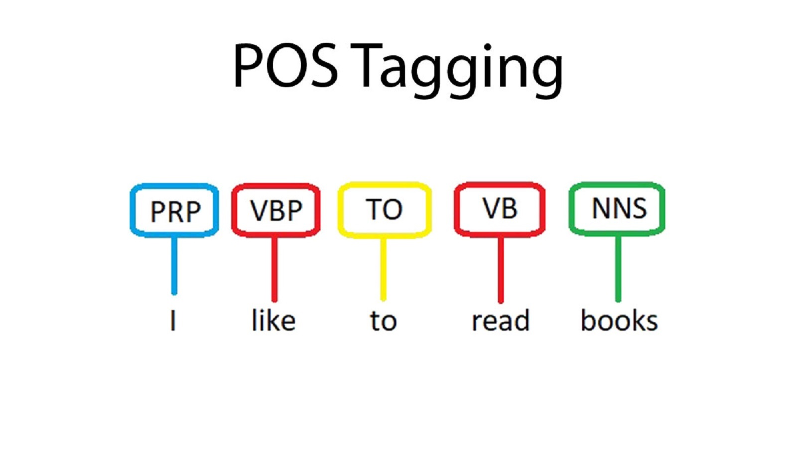
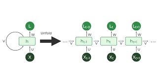
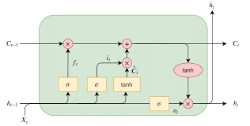
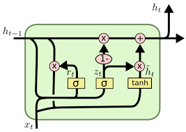
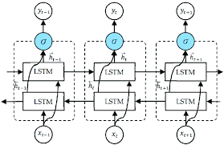

# Neural-POS-Tagger

This repository contains an implementation of a neural sequence model (RNN, LSTM, GRU, etc.) to tokenize and tag sentences with the correct part-of-speech (POS) tags. Given an input sentence, the model predicts the POS tag for each word. For example, given the input:

**Input:**
```shell 
Mary had a little lamb
```
**Output:**

```shell
Mary NOUN
had VERB
a DET
little ADJ
lamb NOUN
```


Note that each part-of-speech tag is separated from its corresponding word by a tab character.

## Dataset

The Universal Dependencies (UD) dataset is used for training and evaluation. You can download it [here](https://universaldependencies.org/). We recommend using the files located at `ud-treebanks-v2.11/UD_English-Atis/en_atis-ud-{train,dev,test}.conllu`. 

For this project, we will use the first four columns of the dataset, which include the word index, lowercase word, original word, and POS tag. Please note that the UD dataset does not include punctuation. You may filter the input sentence to remove punctuation before tagging it.

Feel free to explore other languages' data available in the UD dataset, but we expect a model trained on English data at least. You have the freedom to train on additional languages if you prefer.

## File Structure

- pos_tagger.py
- models/
    - lstm_model.h5
    - gru_model.h5
    - simple_runn_model.h5
- artifacts/


# Concepts

## POS Tagging

Part-of-speech (POS) tagging is the process of assigning a grammatical category or POS tag to each word in a sentence. It is a fundamental task in natural language processing (NLP) and plays a crucial role in various downstream tasks such as text classification, named entity recognition, and syntactic parsing.



Neural networks have been successfully applied to POS tagging tasks. These models, such as RNNs (Recurrent Neural Networks), LSTMs (Long Short-Term Memory), GRUs (Gated Recurrent Units), and biLSTMs (Bidirectional LSTMs), learn to capture the sequential dependencies and context information in the input sentence, improving the accuracy of POS tag predictions.

## RNN, LSTM, GRU, and biLSTM

- **RNN (Recurrent Neural Network):** RNNs are a type of neural network architecture designed to process sequential data. They have recurrent connections that allow information to be passed from one step to the next, enabling the model to capture context information. However, standard RNNs suffer from the vanishing gradient problem, which limits their ability to capture long-range dependencies.




- **LSTM (Long Short-Term Memory):** LSTMs are a variant of RNNs that address the vanishing gradient problem. They introduce memory cells and gating mechanisms, which help the model retain and propagate information over long sequences. LSTMs are particularly effective in capturing long-range dependencies and have become a popular choice for sequence modeling tasks.




- **GRU (Gated Recurrent Unit):** GRUs are another variant of RNNs that simplify the architecture compared to LSTMs. They have fewer gating mechanisms and combine the forget and input gates into a single "update gate." GRUs are computationally efficient and perform competitively with LSTMs on various sequence modeling tasks.



- **biLSTM (Bidirectional LSTM):** A biLSTM incorporates information from both past and future context by processing the input sequence in both forward and backward directions. This allows the model to access information from both preceding and subsequent words, enhancing its ability to capture context dependencies.



## Contributions

Contributions to this project are highly encouraged! If you have any ideas for improvements, bug fixes, or additional features, feel free to open an issue or submit a pull request. We value and appreciate community contributions as they help make the project better for everyone.

Happy coding!
